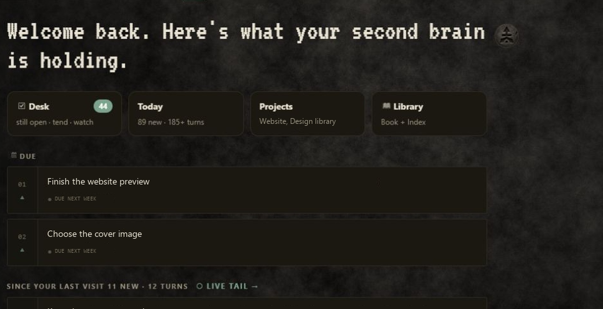
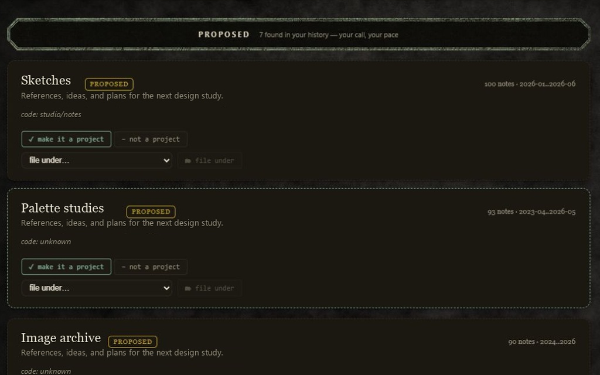
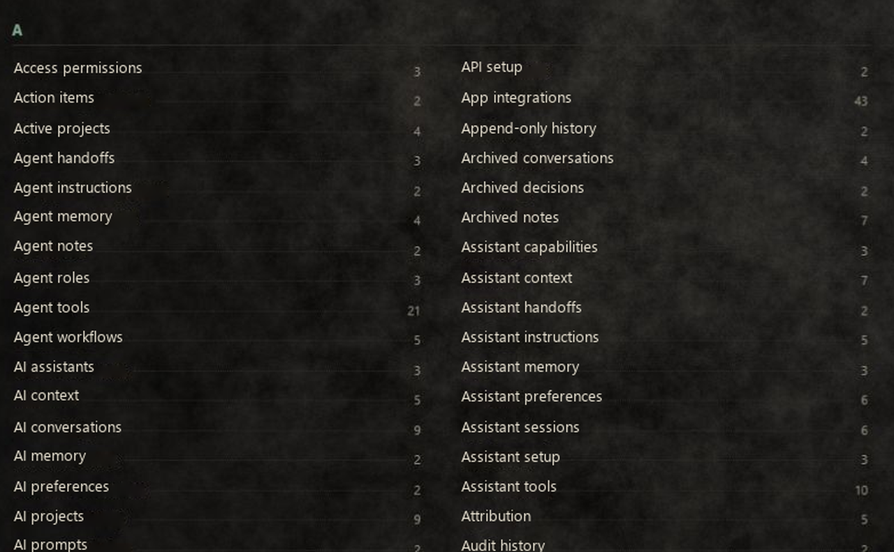
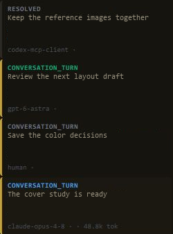
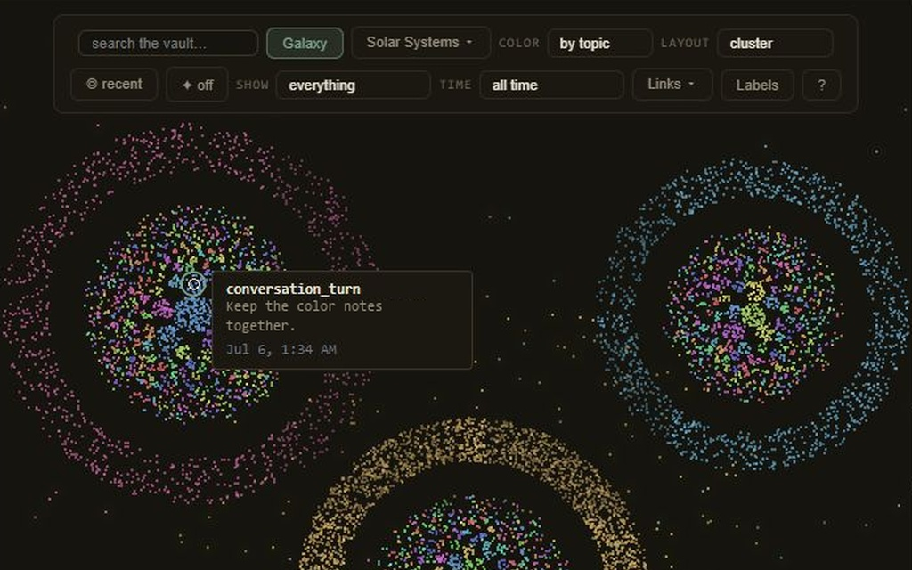

# Inside Cairn

Keep useful work within reach. Cairn stores notes and decisions in a local vault that you and your connected AI tools can read and add to. Each AI keeps its own memory and context. These demos show the optional dashboard for exploring that record.

These recordings show a local installation. Private text uses examples; controls and source attribution are retained. The exact running commit was not captured, so release parity is unverified. See [recording notes](DEMO-NOTES.md).

Select a screenshot or video link below to open its MP4 file. Read about the memory layer and setup options on the [Cairn website](https://cairnremembers.com/).

## Hub

Check due items, return to recent notes and see activity across your projects.

[Open Hub video — 9 seconds](clips/hub.mp4)

The view moves from the welcome and Desk / Today / Projects / Library cards through due items, recent notes, and project activity. Memory kinds, counts, timestamps, and the more-projects control stay visible.

## Projects

Browse established projects and review suggested groupings. The clip shows the available choices; it does not apply a project change.

[Open Projects video — 18 seconds](clips/projects.mp4)

Approved projects open the clip. Proposed candidates follow, with “make it a project”, “not a project”, and “file under” controls. Emerging candidates finish the tour, holding on “promote to project” and “not a project”. No project action is pressed in this recording.

## Index

Browse saved notes by topic. This clip scrolls through example AI and memory topics, with the recorded counts beside them.

[Open Index video — 6 seconds](clips/index.mp4)

The Index shows a populated A section with example AI and memory topics. The view scrolls down through the two-column list, then holds on the final rows. Counts and controls are retained from the recording; clip timing is edited.

## Live Feed

Inspect recorded activity and its source labels. This clip combines two recordings; it does not show a new handoff between assistants.

[Open Live Feed video — 14 seconds](clips/live-feed.mp4)

The first four seconds show an earlier genuine READ event, labeled “live”, “31ms”, and “1 results”. The video then cuts to a separate recording containing gpt-6-astra, human, and claude-opus-4-8 entries, including the original 48.8k tok field. This is a tour of recorded activity; it does not demonstrate a new cross-assistant handoff.

## Connections

Hover over points in the memory map to preview their notes, kinds and dates. The clip shows five recorded positions.

[Open Connections video — 8 seconds](clips/connections.mp4)

Five recorded hover positions reveal connected memories. Each tooltip retains its actual kind and date; only its private excerpt is replaced. The graph and links are original, with no Recent-ring toggles or invented interactions.

## Bring your history with you

Import supported ChatGPT, Claude or Gemini exports to bring earlier conversations into the vault. Imports preserve available conversation text; a separate backfill workflow can extract facts and decisions. For new work, save notes or enable a supported capture integration. Available detail depends on the source and settings.

## Get Cairn

Install Cairn, connect a compatible app, then ask its assistant to save and read a test note. Follow the [setup guide for release 0.3.3](https://github.com/CairnRemembers/cairn/blob/v0.3.3/QUICKSTART.md). The dashboard, search by meaning and automatic capture are optional, separate setup steps.
